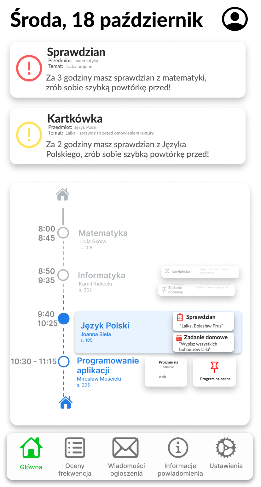

# LiPlus - Readme

## Spis Treści

1. [Wprowadzenie](#wprowadzenie)
2. [Uruchomienie](#uruchomienie)
3. [Technologie](#technologie)
4. [Instrukcja Użycia](#instrukcja-użycia)
5. [Licencja](#licencja)
6. [Status Projektu](#status-projektu)
7. [Informacje o Defektach](#informacje-o-defektach)
8. [Autorzy](#autorzy)

## Wprowadzenie

LiPlus to aplikacja stworzona jako alternatywa dla dziennika Librus, oferująca większą elastyczność i rozszerzoną funkcjonalność. Celem projektu jest zapewnienie użytkownikom bardziej intuicyjnego interfejsu oraz dodatkowych opcji, aby ułatwić zarządzanie szkolnymi obowiązkami.

## Uruchomienie

### Wymagania Sprzętowe

- Komputer lub telefon z dostępem do internetu
- Przeglądarka internetowa (np. Google Chrome, Mozilla Firefox, Safari)

### Instalacja

1. Sklonuj repozytorium LiPlus.
2. Upewnij się, że masz zainstalowane środowisko Node.js.
3. Otwórz terminal w katalogu projektu.
4. Uruchom polecenie `npm install` w terminalu, aby zainstalować wszystkie wymagane zależności.
5. Po zakończeniu instalacji, uruchom aplikację za pomocą polecenia `npm start`.

## Technologie

- Node.js
- React.js
- JavaScript
- HTML
- CSS
- Figma

## Instrukcja Użycia

Aplikacja jest bardzo intuicyjna w użyciu. Po uprzednim zalogowaniu, użytkownik zostanie przekierowany na ekran domyślny. Na dolnym pasku dostępne są inne funkcje aplikacji, równie proste w użyciu.

## Licencja

W przypadku chęci użycia jakichkolwiek własności intelektualnych z tego projektu, należy uprzednio zkontaktować się mailowo: igornowak10@gmail.com

## Status Projektu

Aktualnie projekt jest w fazie rozwoju. Planowane są dalsze zmiany i ulepszenia, aby zapewnić jeszcze lepsze doświadczenie użytkownika.

## Informacje o Defektach

Brak znanych defektów w tej chwili. Wszelkie znalezione błędy prosimy zgłaszać na stronie GitHub projektu.

## Autorzy

- [Tomasz Siedlecki](https://github.com/tomekSiedlecki)
- [Damian Tymofijewicz](https://github.com/green-otaku)
- [Igor Nowak](https://github.com/nowigor)
